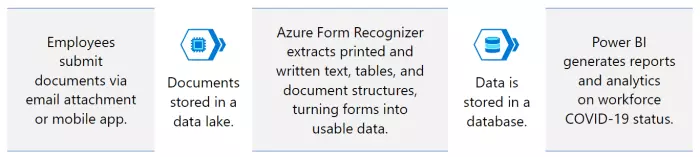

## About this Solution Accelerator

The rapid, accurate verification of COVID-19 vaccination and infection statuses has become a global priority for returning to work. Manual data entry slows and introduces errors to any COVID-19 compliance effort, and many organizations lack the internal expertise to deploy automated solutions that deliver reliable insights.

The COVID-19 Vaccine Proof and Test  Verification Solution Accelerator mass processes and digitizes vaccine and viral test result forms. The AI-powered Azure Form Recognizer turns those documents into usable data that is translated into actionable insights, visualized in Power BIto help validate compliance and inform evolving health and safety strategies. 

### Challenges

* Lack of information required to provide safe, healthy working environments.
* Need for faster, simpler documentation submission and internal review processes.
* Inability to meet changing internal, local, national, and union regulatory requirements.
* Eliminate the excess cost of manual data entry and resulting errors.
* Limited time and resources to enable development pipelines for automated form recognition and data analytics.

> 80% of US organizations plan to continue requiring employees to submit proof of vaccination or weekly test results.

### Benefits

* Quickly verify the vaccination and test status of workforce with real-time data.
* Significantly reduce time to deployment with pre-built solution.
* Enable user-friendly form submission via email attachments and mobile application.
* Easily comply with internal and external regulations.
* Visualize comprehensive, daily insights into vaccination status and test results.
* Reduce costs and increase efficiency compared to manual data entry.

### How it Works

The COVID-19 Vaccine Proof and Test Verification Solution Accelerator digitizes the collection, analysis, and verification of vaccine and test result forms.

