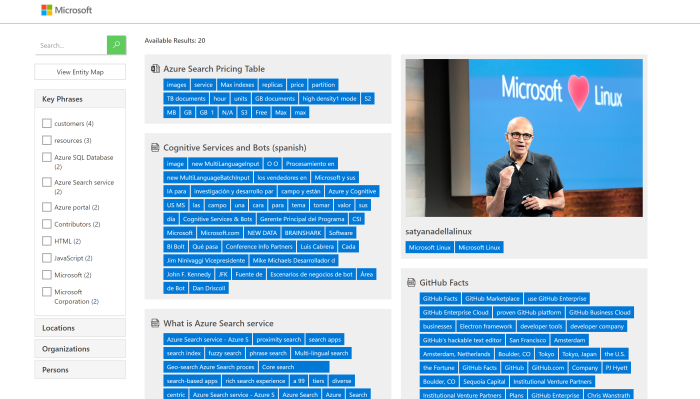

## About this Solution Accelerator

Welcome to the Knowledge Mining Solution Accelerator! This accelerator provides developers with all of the resources they need to quickly build an initial Knowledge Mining prototype with [Azure Cognitive Search](https://docs.microsoft.com/azure/search/cognitive-search-concept-intro). Use this accelerator to jump-start your development efforts with your own data or as a learning tool to better understand how you can use Cognitive Search to meet the unique needs of your business.

In this repository, we've provided you with all of the artifacts you need to quickly create a Cognitive Search Solution including: templates for deploying the appropriate Azure resources, assets for creating your first search index, templates for using custom skills, a basic web app, and PowerBI reports to monitor search solution performance. We've infused best practices throughout the documentation to help guide you. With Cognitive Search, you can easily index both digital data (such as documents and text files) and analog data (such as images and scanned documents).

> Note: This guide uses the AI enrichment feature of Cognitive Search. AI enrichment allows you to ingest many kinds of data (documents, text files, images, scanned docs, and more), extract their contents, enrich and transform it, and then index it for exploration purposes. To learn more about this feature, see the [AI in Cognitive Search](https://docs.microsoft.com/azure/search/cognitive-search-concept-intro) doc.

Once you're finished, you'll have a web app ready to search your data.

