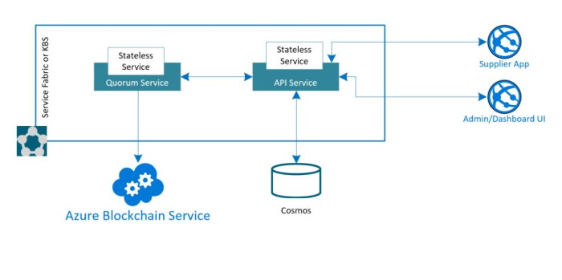

## About this Solution Accelerator

This accelerator was built to provide developers with all of the resources needed to quickly build an initial [Azure Blockchain Service](https://azure.microsoft.com/en-us/services/blockchain-service/) Marketplace solution. Use this accelerator to jump start your development efforts with Blockchain and Azure.

This repository contains the steps, scripts, code, and tools to create a Quorum network and application. 00_Resource_Deployment will create the necessary supporting resources in Azure (Cosmos DB). 01_Quorum_Deployment will walk you through deploying an Azure Blockchain Service network, and once deployed, it will help you configure and deploy a marketplace smart contract on the network. Finally, 03_Application_Deployment will deploy and host your application locally or in your subscription.

