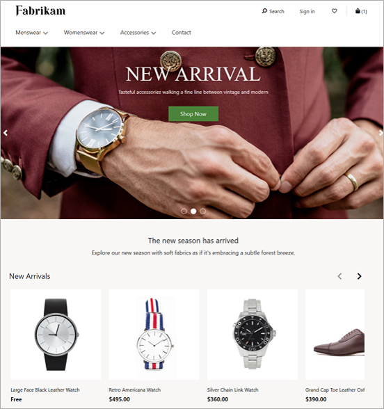
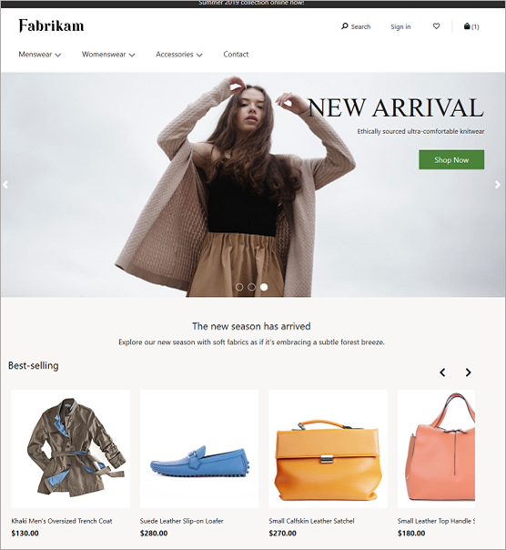
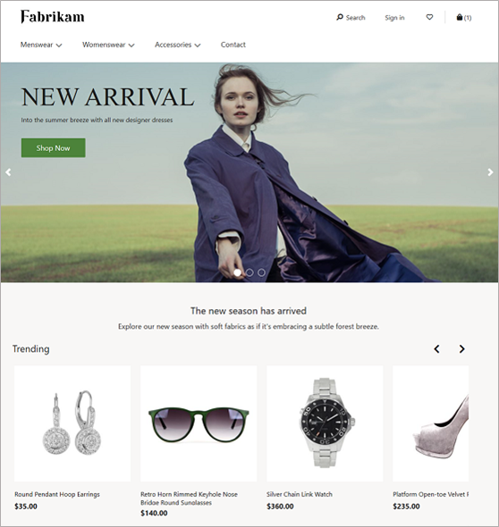
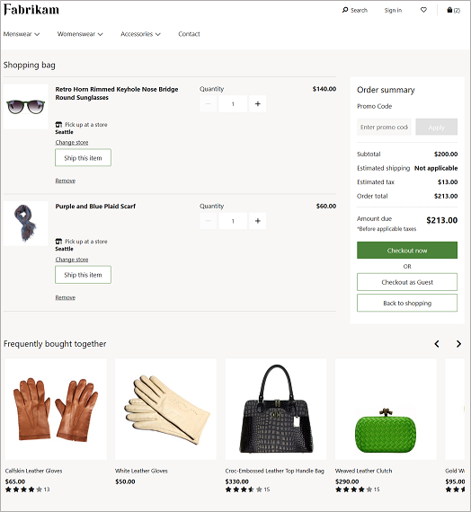
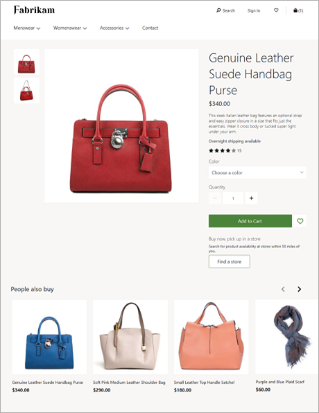
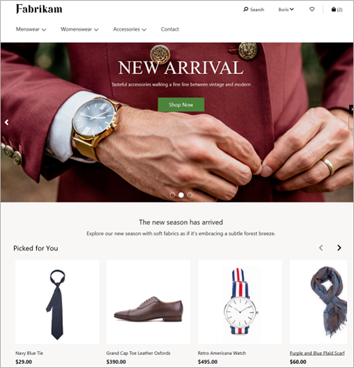
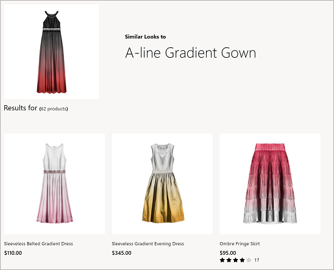
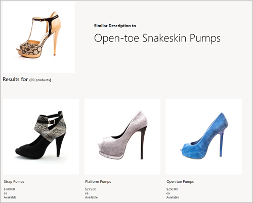

## About this Technology Accelerator

Intelligent Recommendations democratizes AI and machine learning recommendations through a codeless and powerful experience powered by the same technology that fuels Xbox, Microsoft 365, and Microsoft Azure. Businesses can now provide relevant discovery for customers with this new, innovative AI for personalization and recommendations.

Using modern machine-learning algorithms, Intelligent Recommendations provides personalized product recommendations and telemetry insights. These recommendations and insights help you:

* Significantly improve catalog navigation and item discovery.
* Create upsell and cross-sell opportunities.
* Improve shoppers' experiences and product usability.

### Capabilities

Intelligent Recommendations helps companies drive better engagement, conversion, revenue, and customer satisfaction. Intelligent Recommendations is a general purpose service that offers one-of-a-kind, patented capabilities that more effectively drive desired outcomes out of the box such as “shop similar looks,” “shop by description,” “real time,” “session based”, Item based recommendations that can combine User interactions and Item Metadata. Businesses can promote and personalize any content type, such as sellable products, consumable media, documents, videos, and more.

Intelligent Recommendations provides the following capabilities for businesses:

* **Built-in world-class AI-ML delivers amazing, personalized results within minutes.** Provide insightful, personalized, tailored, and more engaging customer experiences from existing user behavior data or item metadata, to create measurable lift in any business.
* **Easy to integrate and extend in any ecosystem and experience.** Use codeless tooling guided by business intuition to easily try, build, and deliver any model customization. When paired with extensible APIs, this allows seamless integration into any ecosystem.
* **Trustworthy software service at scale.** Microsoft is democratizing for all businesses the machine-learning expertise, compliant platform, and high-scale capabilities that we use ourselves, so businesses can focus on the next horizon of growth and innovation.
* **Win over customers with delightful discovery.** Power hyper-relevant suggestions for any customer or product on Azure, ensuring a personalized journey every time a customer interacts with your business.
* **Highly composable, easily extensible.** Highly adaptable to custom business scenarios and logic, based on input data and algorithm choice.

### Business applications of recommender systems

Intelligent Recommendations enables businesses to automate relevant recommendations, including personalized results for new and returning users, and the ability to interpret both user interactions and item or user metadata. In return, businesses receive tailored recommendations models based on their needs and business logic. Intelligent Recommendations frees companies from the tedious management of editorial collections. Instead, it helps drive engagement, run experiments, and build trust with consumers.

### Example supported scenarios

Intelligent Recommendations provides businesses with a toolkit of relevant scenarios, including:

* **Personalized recommendations for end users:** Includes a list of unique content for a specific user based on their consumer habits and interactions. Businesses can recommend products, articles, videos, and more.
* **Similar items:** Based on a variety of signals (user interactions) or metadata (such as images, text, friends, or demographics). Intelligent Recommendations can recommend visually similar items in a catalog (for example, floral-patterned shirts) or show similar wine based on the description and taste notes.
* **Real-time and session-based recommendations for users:** Each customer journey can now have unique recommendations, even new customers.
* **Basket completion:** Shows complementary items for users based on what is already in their cart.

These interactions can have other metadata, such as the time of transaction, amount of money, duration of interaction, and more.

The following table describes the entire catalog of automated product recommendations available for you to integrate into your existing store experiences. Recommendations can be further distinguished by the scenario. For these cases, certain lists will have a selectable algorithm that diversifies the results returned.

**Scenario** | **Description** | **Example**
[New](https://docs.microsoft.com/en-us/industry/retail/intelligent-recommendations/trending-lists#new-and-rising-releases-trending) | Returns a list of the newest products that have been recently assorted to channels and catalogs. | 
[Popular](https://docs.microsoft.com/en-us/industry/retail/intelligent-recommendations/trending-lists#popular-products) | Returns a list of products that are ranked by the highest number of sales. | 
[Trending](https://docs.microsoft.com/en-us/industry/retail/intelligent-recommendations/trending-lists) | Returns a list of the highest performing products for a given period, ranked by highest number of sales. | 
[Frequently Bought Together](https://docs.microsoft.com/en-us/industry/retail/intelligent-recommendations/contextual-lists#frequently-bought-together-cart) | Returns a list of products that are commonly purchased together (complementary) with the contents of the consumer's current cart. | 
[People Also Like](https://docs.microsoft.com/en-us/industry/retail/intelligent-recommendations/contextual-lists#people-also-like) | Returns products for a given seed product based on consumer purchase patterns. Can be changed based on consumer action (purchase, views). | 
[Picks For You](https://docs.microsoft.com/en-us/industry/retail/intelligent-recommendations/personalized-recommendations) | Returns a personalized list of products based on purchase patterns of the signed-in user. For an anonymous guest user, this list will be collapsed. | 
[Shop Similar Looks](https://docs.microsoft.com/en-us/industry/retail/intelligent-recommendations/contextual-lists#visually-similar-recommendations) | Returns a list of products with visually similar images. | 
[Shop Similar By Description](https://docs.microsoft.com/en-us/industry/retail/intelligent-recommendations/contextual-lists#textually-similar-recommendations) | Returns a list of products with textually similar content descriptions. | 
