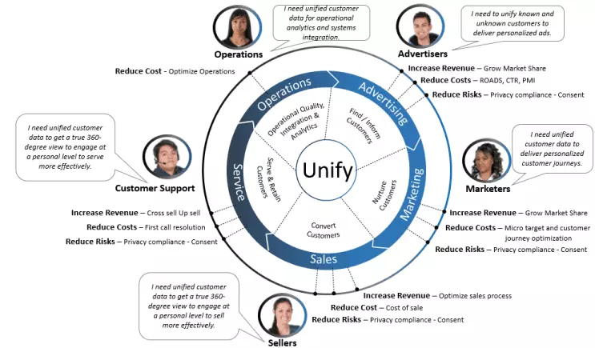

## About this Solution Accelerator

Managing customer data from multiple sources and building a unified Customer 360 view is not a new challenge. But it is becoming increasingly difficult with increased number of interaction channels and touch-points with customers. By combining the power of Azure Synapse Analytics with Dynamics 365 Customer Insights, we can help organizations build a comprehensive view of customers and enable them to provide the best customer experience.

This solution accelerator helps developers with all the resources needed to build an end-to-end Customer 360 solution.

## Why Customer 360?

