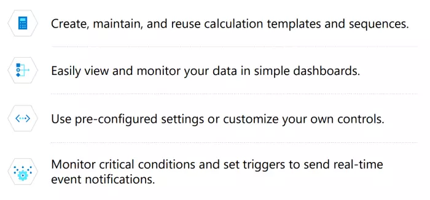

## About this Solution Accelerator

Companies across heavy industries recognize their increasingly important roles in reducing greenhouse gas emissions. However, it’s commonly difficult to find the data and insights necessary to understand what sources and assets drive emissions and how to reduce them efficiently and cost-effectively.

The Carbon Tracing Basic Flare Solution Accelerator can help. It leverages domain knowledge with data analytics to transform your data into opportunities to track and cut your flare emissions by streamlining and automating diverse types of data to provide a clear, auditable, and accurate view of emissions.

### Challenges

* Unable to identify and correct operational and compliance in a timely manner.
* Unable to centralize and integrate data from disparate systems and data sources.
* Lack of real-time data and analytics tools to understand how to cut emissions.
* Reliance on manual data collection and analysis solutions are inefficient and unpredictable.
* Inability to meet regulator auditing and reporting requirements.
* Mounting stakeholder demand for transparency and emissions reduction plans

> A 10% increase in operating efficiency results in a 4% decrease in emission intensity.

### Benefits

* Create customized reports and dashboards to accurately analyze and audit your emissions data.
* Monitor critical conditions and automate notifications for timely corrective action.
* Easily report on emissions to meet regulatory requirements and stakeholder demand.
* Reduce development time using pre-built,pre-configured code and architecture.
* Recognize trends and predict corrective actions.
* Leverage issue notification and escalation systems to alert relevant parties and reduce response time. • Avoid costs of non-compliance.

### How it Works

The Carbon Tracing Basic Flare Solution Accelerator consumes, tags, and organizes your existing and real-time data into streamlined databases to efficiently scale calculations and analytics.

