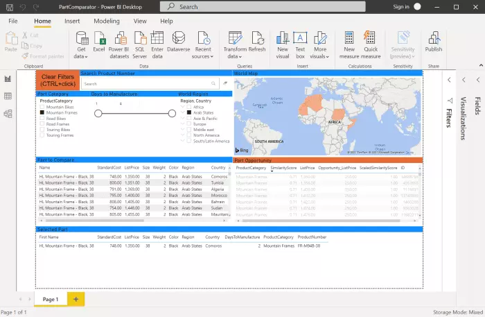

## About this Solution Accelerator

This accelerator was built to provide developers with all of the resources needed to build a solution to find ideal replaceable parts comparing with its characteristics for avoiding supplier chain part procurement issues using Azure Synapse Analytics and Azure Machine Learning.

