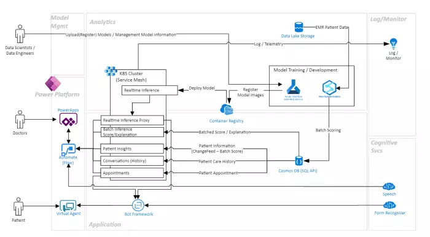

## About this Solution Accelerator

While the healthcare sector is rapidly transforming due to the collection of immense amounts of patient information, the huge volume of data is impossible for human beings to analyze. This is where Artificial Intelligence (AI) can be used.

AI uncovers patterns and delivers insights about data quickly, improving healthcare professionals' abilities to provide personalized care, also known as precision medicine.

Machine Learning Patient Risk Analyzer Solution Accelerator is an end-to-end (E2E) healthcare app that leverages ML prediction models (e.g., Diabetes Mellitus (DM) patient 30-day re-admission, breast cancer risk, etc.) to demonstrate how these models can provide key insights for both physicians and patients. Patients can easily access their appointment and care history with infused cognitive services through a conversational interface.

In addition to providing new insights for both doctors and patients, the app also provides the Data Scientist/IT Specialist with one-click experiences for registering and deploying a new or existing model to Azure Kubernetes Clusters, and best practices for maintaining these models through Azure MLOps.

### What can it do?

This Solution Accelerator provides guidance on how healthcare companies can create an electronic patient portal tailored to their needs. The SA is built for three different target audiences - patient, doctor, and data scientists and/or data engineers. An overview of the functionalities it provides for each user is below:

#### Patient

* Dialog-based user interface through a chatbot
* Access to personalized risk assessments
* Explanations of their risk assessment results (in plain English)
* Automated assistance on tasks such as appointment scheduling and management
* Intelligent assistance with enrollment

#### Doctor

* Delivers patient insights by quickly applying ML models to patient data
* Performs "What-if analysis"
* Consolidates patient insights and intelligent support (Text-to-Speech)

#### Data Scientist/Data Engineer

* Demonstrates how to trains ML Models using AML and Azure Synapse Studio
* Publishes the model via Azure Synapse Studio (integrated)
* Provides real-time scoring endpoint
* Provides batch model scoring/explanation endpoint
