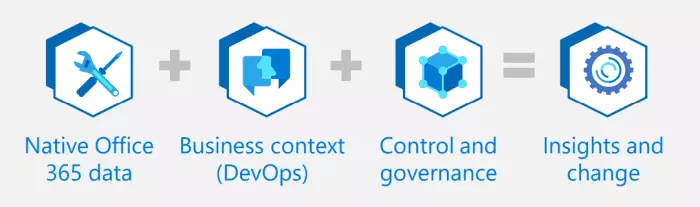

## About this Accelerator

Businesses are using the power of data to transform their organization's systems and processes, but many overlook that impact of applying the same principles to its workforce.

The Workplace Intelligence Accelerator can help. It leverages machine learning and big data analytics to bring together and transform your data, allowing you to build and deploy a machine learning model to easily identify factors that influence productivity and engagement

### Challenges

* Customer wants to create, manage, and track targeted change management plans to help reduce meeting load and increase focus time.
* Customer wants to use research-based behavioral insights and workflow information to learn how the organization currently gets work done and how to maintain or change work patterns over time.
* Customer wants to keep valued employees in business-critical rolls and keep internal leadership pipeline full. Customer wants to increase employee satisfaction and engagement without reducing productivity

> Inspired employees are 125% more productive than an employee who is merely satisfied

### Benefits

* Easily launch your solution using pre-built, pre-configured GitHub code and architecture.
* Gain more collaboration time, improve your meetings, and share knowledge.
* Identify work habits or distractions that reduce your team's ability to focus on core priorities.
* Determine effective means to improve employees' work-life balance.
* Reduce development time with end-to-end unified analytics via Azure Synapse Analytics, Azure Machine Learning, and Power BI.
* Quickly analyze data to determine which factors impact workforce efficiency.

### How It Works

Azure Synapse Analytics leverages AI and Power BI in a dashboard that provides visibility into work habit data from Microsoft 365 to help your team optimize efficiency, improve collaboration, and maintain health work/life balance.

